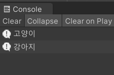

#EnumPro  

해당 에셋은 Enum의 Extention을 제공합니다.

C#에서 Enum을 사용하다보면, Int 이외 Float, String, Bool을 수록하고 싶은 경우가 있습니다.
이를 해당 에셋을 통해 구현할 수 있습니다.

---
```{.cs}
private enum Animal
{
    [EnumString("강아지")]
    Dog,

    [EnumString("고양이")]
    Cat
}

//전역 변수로 동물에 대한 Enum 변수를 선언합니다.
private Animal _animal = Animal.Cat;

private void Start()
{
    //애트리뷰트에 적은 값을 호출할 때는, getString을 사용합니다.
    Debug.Log(_animal.getString());
    Debug.Log(Animal.Dog.getString());
}
```
Console :  
  

지원하는 애트리뷰트 :  
`EnumString(String)`, `EnumFloat(Float)`, `EnumBool(Bool)`

값 가져오는 함수 :  
`getString()`, `getFloat()`, `getBool()`